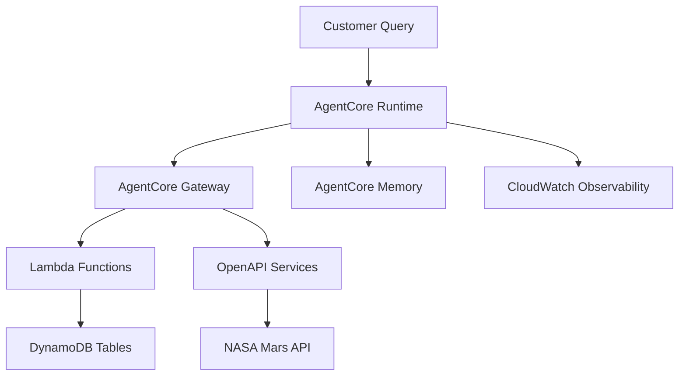

# AgentCore Complete Example - Customer Support Agent

A comprehensive implementation of Amazon Bedrock AgentCore demonstrating all core components: Runtime, Gateway, Memory, Identity, and Observability. This example builds a complete customer support agent that can handle customer inquiries, check warranties, search knowledge bases, and access external APIs.

## 🎯 Use Case: Intelligent Customer Support

This example implements a sophisticated customer support agent that demonstrates real-world AgentCore capabilities:

### Customer Support Scenarios
- **Profile Management**: Look up customer information using ID, email, or phone
- **Warranty Services**: Check warranty status for products using serial numbers
- **Knowledge Base**: Search internal documentation for troubleshooting guides
- **External Data**: Access NASA Mars weather data via OpenAPI integration
- **Memory Continuity**: Remember customer context across conversation turns

### Architecture Components



## 🛠️ What This Example Demonstrates

### 1. AgentCore Runtime
- **Containerized Agent**: Deployed as a managed container service
- **Auto-scaling**: Handles variable customer support loads
- **Environment Configuration**: Dynamic configuration via environment variables

### 2. AgentCore Gateway (MCP Protocol)
- **Lambda Integration**: Direct access to internal business systems
- **OpenAPI Integration**: External API access with authentication
- **Tool Orchestration**: Unified interface for multiple data sources

### 3. AgentCore Memory
- **Conversation Continuity**: Maintains context across customer interactions
- **Customer History**: Remembers previous support cases and preferences
- **Contextual Responses**: Provides personalized support based on history

### 4. AgentCore Identity & Security
- **IAM Integration**: Secure access to AWS resources
- **API Key Management**: Secure external API authentication
- **Role-based Access**: Proper permissions for each component

### 5. AgentCore Observability
- **CloudWatch Integration**: Comprehensive logging and monitoring
- **X-Ray Tracing**: Request flow visualization
- **Performance Metrics**: Response times and success rates

## 🚀 Quick Start

### Prerequisites
- AWS CLI configured with appropriate permissions
- Python 3.9+ installed
- AgentCore SDK installed: `pip install bedrock-agentcore-starter-toolkit`

### 1-Minute Deploy
```bash
git clone <repository>
cd agentcore-complete-example
python deploy.py
```

### Test Your Agent
```bash
python validate.py
```

## 💬 Usage Examples

Once deployed, your customer support agent can handle various scenarios:

### Customer Profile Lookup
```
User: "Hi, I need help with my account. My email is john.doe@email.com"
Agent: "I found your profile, John! I can see you're a Premium customer since 2023. How can I help you today?"
```

### Warranty Check
```
User: "My Gaming Console Pro isn't working. Serial number is ABC12345678"
Agent: "I've checked your warranty status. Your Gaming Console Pro is still under warranty until March 2025. Let me help you troubleshoot..."
```

### Knowledge Base Search
```
User: "My device keeps overheating during charging"
Agent: "I found several troubleshooting steps for overheating issues. First, try using the original charger..."
```

### External API Integration
```
User: "What's the weather like on Mars today?"
Agent: "According to NASA's latest data from Mars, the current temperature is -80°C with clear skies..."
```

### Memory & Context
```
User: "Remember my previous issue with the console?"
Agent: "Yes, we discussed the overheating issue with your Gaming Console Pro (serial ABC12345678). Have you tried the troubleshooting steps I suggested?"
```

## ⚙️ Configuration

### Environment Variables

Customize your deployment with these environment variables:

```bash
# AWS Configuration
export AWS_REGION=us-west-2                    # Default: us-east-1

# Stack Configuration  
export STACK_NAME=my-agentcore-stack           # Default: agentcore-customer-support
export GATEWAY_NAME_PREFIX=my-gateway          # Default: customer-support-gateway
export GATEWAY_ROLE_PREFIX=my-gateway-role     # Default: agentcore-gateway-role

# Agent Configuration
export AGENT_NAME=my_support_agent             # Default: customer_support_agent

# API Keys
export NASA_API_KEY=your_nasa_api_key          # Default: DEMO_KEY
```

### Configuration File

The `config.py` file centralizes all configuration values:

- AWS region and service settings
- CloudFormation stack names and templates
- S3 bucket and object configurations
- Gateway and target naming
- Runtime agent settings
- API credentials

## 📋 Deployment

### Clean Deployment Process

The project has been updated to remove all hardcoded values. Follow these steps for a clean deployment:

#### 1. Clean Previous Deployment (if exists)

```bash
# Remove old deployment artifacts
rm -f deployment_info.json
rm -f .bedrock_agentcore.yaml

# Optional: Clean up previous AWS resources
python cleanup.py
```

#### 2. Configure Environment

```bash
# Set your preferred AWS region
export AWS_REGION=us-west-2  # or your preferred region

# Optional: Customize resource names
export STACK_NAME=my-agentcore-stack
export GATEWAY_NAME_PREFIX=my-gateway
export AGENT_NAME=my_support_agent

# Optional: Set NASA API key
export NASA_API_KEY=your_actual_api_key
```

#### 3. Deploy Fresh Resources

```bash
# Deploy with dynamic configuration
python deploy.py
```

This will create:
- New CloudFormation stack with unique names
- New S3 bucket with UUID suffix
- New AgentCore Gateway with unique ID
- New AgentCore Runtime with unique ARN
- Fresh `deployment_info.json` with your dynamic values

#### 4. Validate Deployment

```bash
python validate.py
```

#### 5. Clean Up When Done

```bash
python cleanup.py
```

## ✨ Dynamic Features

✅ **Dynamic Gateway Creation**: Creates new gateway with unique names instead of using hardcoded IDs
✅ **Region Flexibility**: Deploy to any AWS region via environment variables  
✅ **Configurable Names**: Customize stack names, gateway names, and agent names
✅ **API Key Management**: Set NASA API key via environment variable
✅ **Centralized Configuration**: All settings managed through `config.py`

### What Changed

✅ **Removed Hardcoded Values**:
- Gateway ID: `customer-support-gatewat-allz9rxw5k` → Dynamic generation
- Account ID: `233736836855` → Uses your AWS account
- Region: `us-east-1` → Configurable via `AWS_REGION`

✅ **Dynamic Generation**:
- Gateway names include UUID suffixes
- S3 buckets have unique names
- All ARNs reflect your actual AWS account

✅ **Configuration Management**:
- Centralized in `config.py`
- Environment variable support
- No hardcoded values in code

## 📊 Example Fresh Deployment Output

After running `python deploy.py`, your new `deployment_info.json` will contain your actual values:

```json
{
  "cloudformation": {
    "CustomerSupportLambdaArn": "arn:aws:lambda:us-west-2:YOUR-ACCOUNT:function:agentcore-example-customer-support"
  },
  "gateway": {
    "gateway_id": "my-gateway-abc12345",
    "gateway_url": "https://my-gateway-abc12345.gateway.bedrock-agentcore.us-west-2.amazonaws.com/mcp"
  },
  "runtime": {
    "agent_arn": "arn:aws:bedrock-agentcore:us-west-2:YOUR-ACCOUNT:runtime/my_support_agent-xyz67890"
  }
}
```

## 📁 Project Structure

```
agentcore-complete-example/
├── agents/
│   ├── runtime_agent.py          # AgentCore Runtime entrypoint
│   └── strands_agents.py         # Local agent implementation
├── infrastructure/
│   ├── cloudformation/           # AWS infrastructure templates
│   ├── lambda-functions/         # Customer support Lambda functions
│   └── openapi-specs/           # NASA API specifications
├── tools/
│   └── web_search.py            # DuckDuckGo web search tool
├── utils/
│   ├── aws_helpers.py           # AWS utility functions
│   ├── gateway_helpers.py       # Gateway management utilities
│   └── memory_helpers.py        # Memory management utilities
├── config.py                    # Centralized configuration
├── deploy.py                    # Complete deployment script
├── validate.py                  # Deployment validation
├── cleanup.py                   # Resource cleanup
└── requirements.txt             # Python dependencies
```

## 🔍 Monitoring & Observability

### CloudWatch Dashboard
Access your agent's performance metrics:
```
https://console.aws.amazon.com/cloudwatch/home?region=YOUR-REGION#gen-ai-observability/agent-core
```

### Key Metrics to Monitor
- **Invocation Count**: Number of customer interactions
- **Response Time**: Average agent response latency
- **Error Rate**: Failed requests percentage
- **Tool Usage**: Which tools are most frequently used
- **Memory Utilization**: Context storage and retrieval patterns

### Logs and Tracing
- **CloudWatch Logs**: Detailed agent execution logs
- **X-Ray Traces**: Request flow visualization
- **Custom Metrics**: Business-specific KPIs

## 🤝 Contributing

This example serves as a foundation for building production customer support agents. Extend it by:

1. **Adding New Tools**: Integrate additional business systems
2. **Custom Memory Strategies**: Implement domain-specific memory patterns
3. **Enhanced Security**: Add advanced authentication and authorization
4. **Performance Optimization**: Implement caching and request optimization
5. **Multi-language Support**: Add internationalization capabilities

## 📚 Learn More

- [AgentCore Documentation](https://docs.aws.amazon.com/bedrock/latest/userguide/agents-core.html)
- [MCP Protocol Specification](https://modelcontextprotocol.io/)
- [Bedrock Agent Best Practices](https://docs.aws.amazon.com/bedrock/latest/userguide/agents-best-practices.html)
- [Tutorial Blog Post](./TUTORIAL_BLOG_REVISED.md)
